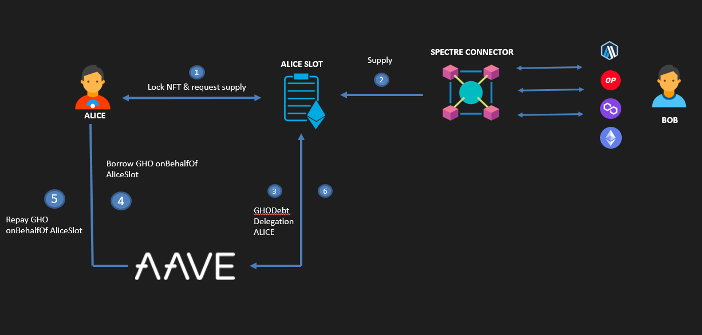

# Spectre-Protocol, a protocol that provides liquidity in GHO for NFT Users
## Overview
Spectre is an innovative protocol that extends Aave, designed to enhance liquidity for NFTs. NFT holders can access liquidity in GHO by finding someone willing to collateralize them, delegating borrowing power to the NFT holder and allowing them to freely utilize the Aave protocol. Each NFT has its Health Factor, with the NFT holder responsible for loans and repayments. Additionally, users collateralizing the NFT can earn interest by lending it on Aave and receive rewards in GHO. The unique contract called 'Slot' simplifies debt management, locking the NFT and facilitating payments. Leveraging Aave's proven infrastructure, Spectre maximizes earning opportunities for both lenders and borrowers. A groundbreaking solution for achieving efficient NFT liquidity in the decentralized finance landscape.
Furthermore, suppliers can contribute collateral to these NFTs from various chains using the CCIP protocol from Chainlink


# Architecture




## Contracts
### SlotUser

Each NFT will need to be locked in a contract we've named 'Slot.' Slot contracts are reusable once the loan is completed, as long as you repay the debt it holds. Users looking to request a loan can deploy as many Slots as needed to include all the NFTs they wish to list. The reason each loan corresponds to a Slot lies in the nature of the Aave protocol, where calculating a user's outstanding debt is measured in the debtTokens they possess.

### Spectre Connector

This contract is responsible for redirecting liquidity from other chains to the Slot where liquidity is intended to be provided, using the Chainlink CCIP protocol.

### Event emitter

To keep the data synchronized with each of the loans and SlotUser contracts deployed as the application grows, it becomes too complex. To address this challenge, a contract has been created to emit the necessary events for data synchronization with a subgraph.

### Usage

#### Build

```shell
$ forge build
```

#### Test

```shell
$ forge test
```

#### Format

```shell
$ forge fmt
```

## Subgraph

We have deployed a subgraph that will assist the interface in consuming data without the need to query each of the users' slots individually.
